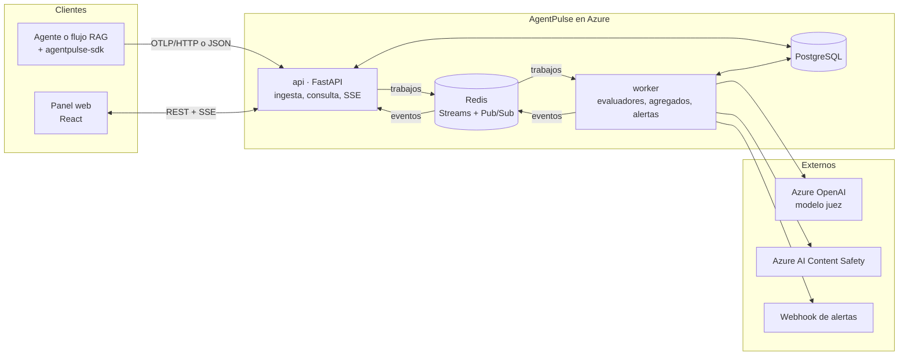

# AgentPulse — Arquitectura del MVP

Versión 0.1 · 2026-10-07

AgentPulse es una plataforma web que evalúa, monitorea y audita agentes conversacionales
y flujos RAG en QA y Producción. Mide latencia, costo por token, alucinaciones y
cumplimiento de guardrails.

La v1 es un monolito modular en Python (FastAPI) con un worker de evaluación asíncrono,
PostgreSQL como único almacén y Redis como cola, desplegado en Azure Container Apps.

## 1. Principios

1. **Guardar antes de evaluar.** La traza se persiste y la ingesta responde; la evaluación ocurre después. AgentPulse observa: nunca añade latencia al agente ni puede tumbarlo.
2. **Pocas piezas.** Un backend, una base de datos, un Redis. Cada pieza extra necesita un ADR.
3. **Estándar en el borde, esquema propio adentro.** Se recibe OpenTelemetry; se guarda en tablas propias.
4. **Evaluadores intercambiables.** Toda métrica es un plugin detrás de una interfaz.
5. **Multi-proyecto desde el día uno.** Toda fila lleva `project_id`, aunque el MVP tenga un solo equipo.

## 2. Vista general



## 3. Decisiones clave

| Decisión | Elección | Por qué | Cambiar cuando |
| --- | --- | --- | --- |
| Forma del backend | Monolito modular: una imagen, dos procesos (`api`, `worker`) | Un solo código que los agentes de programación entienden completo | Un módulo necesite escalar o desplegarse aparte |
| Protocolo de ingesta | OTLP/HTTP con convenciones GenAI de OpenTelemetry + endpoint JSON propio | Un agente ya instrumentado se conecta sin SDK propio | Es el contrato público; no cambia sin ADR |
| Esquema interno | Tablas propias + capa de normalización | Las convenciones GenAI siguen en estado Development | Las convenciones lleguen a estable |
| Almacén | PostgreSQL único, `spans` particionada por mes | Suficiente al volumen de un MVP | Paneles por encima de 2 s o más de ~50 M de spans al mes (umbral orientativo) |
| Cola y tiempo real | Redis Streams + Pub/Sub | Un servicio hace de cola, caché y canal en vivo; igual en local y en Azure | Se necesite retención o reproducción de eventos |
| Cuándo se evalúa | Asíncrono, tras guardar | No afecta al agente evaluado | Se quiera bloquear respuestas en línea (otro producto) |
| Alucinaciones | LLM juez con muestreo | Funciona en español; la detección de groundedness de Azure AI Content Safety está optimizada solo para inglés | El costo del juez supere el presupuesto |
| Evaluadores | Interfaz `Evaluator` propia | No ata el núcleo a una librería | — |
| Frontend | SPA React + Vite | Panel interno, sin SEO ni SSR | Se necesiten páginas públicas |

## 4. Componentes

| Componente | Ruta | Responsabilidad |
| --- | --- | --- |
| SDK de Python | `packages/sdk-python` | Decoradores y gestores de contexto sobre OpenTelemetry; exporta en lotes y en segundo plano |
| CLI | `packages/sdk-python` | `agentpulse eval run`: corre una suite contra un dataset y falla si la nota baja del umbral |
| API de ingesta | `apps/api/src/agentpulse/ingest` | Autentica clave, valida, normaliza, redacta, calcula costo, guarda, encola |
| API de consulta | `apps/api/src/agentpulse/query` | Trazas, métricas, resultados, datasets y configuración para el panel |
| Tiempo real | `apps/api/src/agentpulse/realtime` | Server-Sent Events alimentados por Redis Pub/Sub |
| Evaluación | `apps/api/src/agentpulse/evals` | Interfaz `Evaluator`, evaluadores, cliente del juez, muestreo |
| Alertas | `apps/api/src/agentpulse/alerts` | Reglas de umbral sobre `metrics_1m`, notificación por webhook |
| Panel | `apps/web` | Tablero, visor de trazas, evaluaciones, comparación QA vs Producción |

Regla de dependencias: `ingest`, `query`, `evals`, `alerts` y `realtime` solo importan de `core`, `auth` y `db`.

## 5. Contrato de la API

Ingesta (clave de API: `Authorization: Bearer ap_<ambiente>_<aleatorio>`):

| Método y ruta | Uso |
| --- | --- |
| `POST /v1/otlp/v1/traces` | OTLP/HTTP, protobuf o JSON |
| `POST /v1/traces` | Lote JSON en el esquema interno |
| `POST /v1/traces/{trace_id}/feedback` | Valoración del usuario final (positiva o negativa) |

Consulta (sesión de usuario, JWT):

| Método y ruta | Uso |
| --- | --- |
| `GET /v1/traces`, `GET /v1/traces/{trace_id}` | Lista filtrable y detalle con árbol de spans |
| `GET /v1/metrics/timeseries` | Series por minuto: latencia, costo, tokens, errores, tasas de aprobación |
| `GET /v1/evals/results` | Resultados por evaluador, agente, versión y ambiente |
| CRUD `/v1/evaluators`, `/v1/datasets`, `/v1/experiments`, `/v1/alert-rules`, `/v1/api-keys` | Configuración |
| `GET /v1/stream` | Eventos en vivo (SSE) |
| `GET /healthz`, `GET /readyz` | Salud, sin autenticación |

La ingesta responde `202` con los identificadores aceptados. Límites: tasa por clave y tamaño máximo de lote, configurables en `core/settings.py`.

### Normalización de atributos

Solo `ingest/normalize.py` conoce los nombres de OpenTelemetry.

| Atributo recibido | Campo interno |
| --- | --- |
| `gen_ai.operation.name` | `spans.kind` (`llm`, `retrieval`, `tool`, `agent`, `guardrail`) |
| `gen_ai.provider.name` | `spans.provider` |
| `gen_ai.request.model`, `gen_ai.response.model` | `spans.model` (gana el de respuesta) |
| `gen_ai.usage.input_tokens`, `gen_ai.usage.output_tokens` | `spans.input_tokens`, `spans.output_tokens` |
| `gen_ai.input.messages`, `gen_ai.output.messages` | `spans.input`, `spans.output` |
| `agentpulse.agent.name`, `agentpulse.agent.version` | `traces.agent_id`, `traces.agent_version_id` |
| `agentpulse.retrieval.documents` | `spans.attributes.documents` en spans `retrieval` |
| `session.id` | `traces.session_id` |

Los nombres `gen_ai.*` cambian entre versiones de las convenciones. Fija la versión soportada en una constante y cubre la tabla con pruebas.

## 6. Modelo de datos

| Tabla | Columnas principales |
| --- | --- |
| `projects` | `id`, `name`, `retention_days`, `store_content` |
| `environments` | `id`, `project_id`, `name` (`qa`, `prod`) |
| `api_keys` | `id`, `environment_id`, `prefix`, `key_hash`, `revoked_at` |
| `users`, `memberships` | `user_id`, `project_id`, `role` (`admin`, `editor`, `viewer`) |
| `agents`, `agent_versions` | `id`, `project_id`, `name`; `agent_id`, `version` |
| `traces` | `id`, `project_id`, `environment_id`, `agent_version_id`, `session_id`, `started_at`, `duration_ms`, `status`, `input_tokens`, `output_tokens`, `cost_usd`, `feedback` |
| `spans` | `id`, `trace_id`, `parent_span_id`, `kind`, `name`, `started_at`, `duration_ms`, `provider`, `model`, `input_tokens`, `output_tokens`, `cost_usd`, `input`, `output`, `attributes` |
| `model_pricing` | `provider`, `model`, `input_per_1m_usd`, `output_per_1m_usd`, `valid_from` |
| `evaluators` | `id`, `project_id`, `key`, `enabled`, `threshold`, `sample_rate_qa`, `sample_rate_prod`, `config` |
| `eval_results` | `id`, `trace_id`, `span_id`, `evaluator_key`, `evaluator_version`, `category`, `score`, `label`, `passed`, `reason`, `judge_model`, `judge_cost_usd` |
| `datasets`, `dataset_items` | `id`, `project_id`, `name`; `input`, `expected_output`, `context`, `source_trace_id` |
| `experiment_runs` | `id`, `dataset_id`, `agent_version_id`, `status`, `summary` |
| `metrics_1m` | `project_id`, `environment_id`, `agent_id`, `bucket`, `trace_count`, `error_count`, `latency_p50_ms`, `latency_p95_ms`, `input_tokens`, `output_tokens`, `cost_usd`, `eval_pass_rates` |
| `alert_rules`, `alert_events` | `metric`, `operator`, `threshold`, `window_minutes`, `webhook_url`; `fired_at`, `value` |
| `audit_log` | `id`, `project_id`, `user_id`, `action`, `resource_type`, `resource_id`, `created_at`, `metadata` |

Notas:
- `spans` se particiona por mes sobre `started_at`; la retención borra particiones completas.
- `input`, `output` y `attributes` son `jsonb`. Si `projects.store_content` es falso, `input` y `output` se guardan vacíos.
- El costo usa la fila de `model_pricing` vigente en `started_at`. Modelo sin precio: costo nulo y aviso en el panel, nunca cero.
- El rol de base de datos de la aplicación no tiene `UPDATE` ni `DELETE` sobre `audit_log`.

## 7. Motor de evaluación

```python
class EvalOutcome(BaseModel):
    score: float            # 0.0 a 1.0
    label: str              # p. ej. "faithful", "unfaithful"
    passed: bool
    reason: str
    judge_model: str | None = None
    judge_cost_usd: Decimal = Decimal("0")


class Evaluator(Protocol):
    key: str                # "faithfulness"
    version: str            # sube cuando cambia el prompt o la lógica
    category: Literal["performance", "cost", "guardrail", "quality"]
    requires_llm: bool

    def applies_to(self, trace: TraceView) -> bool: ...
    async def evaluate(self, trace: TraceView) -> EvalOutcome: ...
```

| Evaluador | Tipo | Cobertura por defecto |
| --- | --- | --- |
| `latency` | Determinista | 100 % |
| `cost` | Determinista | 100 % |
| `pii_leak`, `banned_topics`, `json_format`, `length`, `tool_allowlist` | Guardrail determinista | 100 % |
| `prompt_injection`, `harmful_content` | Azure AI Content Safety | QA 100 %, Producción configurable |
| `faithfulness` | LLM juez | QA 100 %, Producción 10 % |
| `answer_relevancy` | LLM juez | QA 100 %, Producción 10 % |
| `context_precision` | LLM juez | Solo QA |

Reglas:
- **Muestreo.** Se decide por traza con un hash estable del `trace_id`, para que sea reproducible. Las trazas con error o con valoración negativa se evalúan siempre.
- **Juez.** Azure OpenAI en Foundry Models, salida estructurada, temperatura 0. Una sola clase `JudgeClient` habla con el proveedor.
- **Aislamiento del contenido.** El prompt del juez delimita el texto evaluado y le indica tratarlo como datos.
- **Calibración.** Antes de activar un evaluador de juez en Producción, se compara con unas 50 trazas etiquetadas a mano y se guarda el acuerdo obtenido.
- **Idempotencia.** Reprocesar un trabajo no duplica resultados: clave única `(trace_id, evaluator_key, evaluator_version)`.
- **Fallo del juez.** Reintentos con espera creciente; al agotarse, el trabajo va a un stream de fallidos y la traza queda sin nota, no con nota falsa.

Redis:
- Stream `traces.ingested`, grupo de consumidores `evaluators`.
- Canal Pub/Sub `events:{project_id}:{environment}` para el panel.

## 8. Despliegue

| Pieza | Azure | Local |
| --- | --- | --- |
| `api` | Container Apps, ingreso HTTPS, mínimo 1 réplica | `docker compose` |
| `worker` | Container Apps, sin ingreso, escala 0 a N por atraso del stream (KEDA) | `docker compose` |
| Panel | Static Web Apps | Vite dev server |
| PostgreSQL | Azure Database for PostgreSQL, Flexible Server | Contenedor |
| Redis | Azure Managed Redis | Contenedor |
| Juez | Azure OpenAI en Foundry Models | Juez falso determinista, o el real con clave |
| Guardrails administrados | Azure AI Content Safety | Desactivado por defecto |
| Identidad | Microsoft Entra ID (OIDC + PKCE) | Proveedor `dev` |
| Secretos | Key Vault con identidad administrada | `.env` no versionado |
| Imágenes | Container Registry | Build local |
| Telemetría propia | Application Insights vía OpenTelemetry | Consola |

- IaC en `infra/` con Bicep. Dos ambientes de la plataforma: `staging` y `prod`.
- CI/CD con GitHub Actions: `make check` en cada PR; push a `main` despliega en `staging`; `prod` con aprobación manual.
- Las migraciones corren como un job previo al despliegue, nunca al arrancar la API.

Variables de entorno principales: `DATABASE_URL`, `REDIS_URL`, `AUTH_PROVIDER` (`dev` o `entra`), `ENTRA_TENANT_ID`, `ENTRA_CLIENT_ID`, `JUDGE_PROVIDER` (`fake` o `azure_openai`), `AZURE_OPENAI_ENDPOINT`, `AZURE_OPENAI_DEPLOYMENT`, `CONTENT_SAFETY_ENDPOINT`.

## 9. Seguridad y auditoría

- Dos planos de autenticación: clave de API para escribir trazas, sesión de usuario para leer. Una clave de ingesta no lee datos.
- Roles: `admin` (claves, evaluadores, miembros), `editor` (datasets, reglas), `viewer` (consulta).
- Redacción de datos personales en la ingesta, antes de guardar.
- Retención por proyecto: se borra contenido por partición; agregados y resultados se conservan.
- `audit_log` registra cada lectura de contenido de trazas y cada cambio de configuración.
- El filtro por `project_id` vive en la capa de repositorio; `tests/test_isolation.py` lo verifica.

## 10. Plan por fases

| Fase | Entrega | Hecho cuando |
| --- | --- | --- |
| 0. Cimientos | Monorepo, Docker Compose, CI, `make check`, `/healthz` | `make dev` levanta todo y el CI pasa en verde |
| 1. Ingesta y trazas | Modelos y migraciones, ingesta JSON y OTLP, costo, SDK, visor de trazas | `examples/rag-agent` envía una traza y se ve su árbol de spans con tokens y costo |
| 2. Métricas en vivo | `metrics_1m`, worker mínimo que los calcula, tablero, filtro por ambiente, SSE | Una traza nueva aparece en el tablero en menos de 5 s, sin recargar |
| 3. Evaluación | Interfaz `Evaluator`, guardrails deterministas, juez de fidelidad y relevancia, muestreo | Una respuesta con un dato inventado queda marcada como no fiel; la calibración queda registrada |
| 4. QA | Datasets, corridas de experimento, CLI, comparación de versiones | `agentpulse eval run` sale con código distinto de 0 si la nota baja del umbral |
| 5. Alertas, auditoría y permisos | Reglas y webhook, `audit_log`, roles, redacción, retención | Cruzar un umbral dispara el webhook; un `viewer` no puede crear claves; pasa la prueba de aislamiento |
| 6. Azure | Bicep, Container Apps, Entra ID, Key Vault, pipeline | Un push a `main` despliega en `staging` y pasa la prueba de humo |

Hasta la fase 6, el acceso de usuarios usa el proveedor `dev` detrás de la misma interfaz que luego implementa Entra ID.

## 11. Fuera del alcance del MVP

- Bloqueo de respuestas en línea (modo gateway o proxy).
- SSO con proveedores distintos de Entra ID, facturación, cuotas por cliente.
- Segundo almacén analítico (ClickHouse u otro).
- SDK en lenguajes distintos de Python; otros lenguajes entran por OTLP.
- Evaluación de voz, imagen o multimodal.

## 12. Preguntas abiertas

- [ ] Volumen esperado de trazas por día.
- [ ] Framework de los agentes a evaluar y si ya emiten OpenTelemetry.
- [ ] Idioma de las conversaciones.
- [ ] Si se puede guardar contenido de prompts de Producción o solo métricas.
- [ ] Región de Azure y modelo juez.
- [ ] Canal de alertas: Teams, Slack o correo.

## 13. Referencias

- Convenciones GenAI de OpenTelemetry: https://github.com/open-telemetry/semantic-conventions-genai
- Detección de groundedness, Azure AI Content Safety: https://learn.microsoft.com/en-us/azure/ai-services/content-safety/concepts/groundedness
- Reglas de Antigravity: https://www.antigravity.google/docs/rules
- Memoria de Claude Code: https://code.claude.com/docs/en/memory
